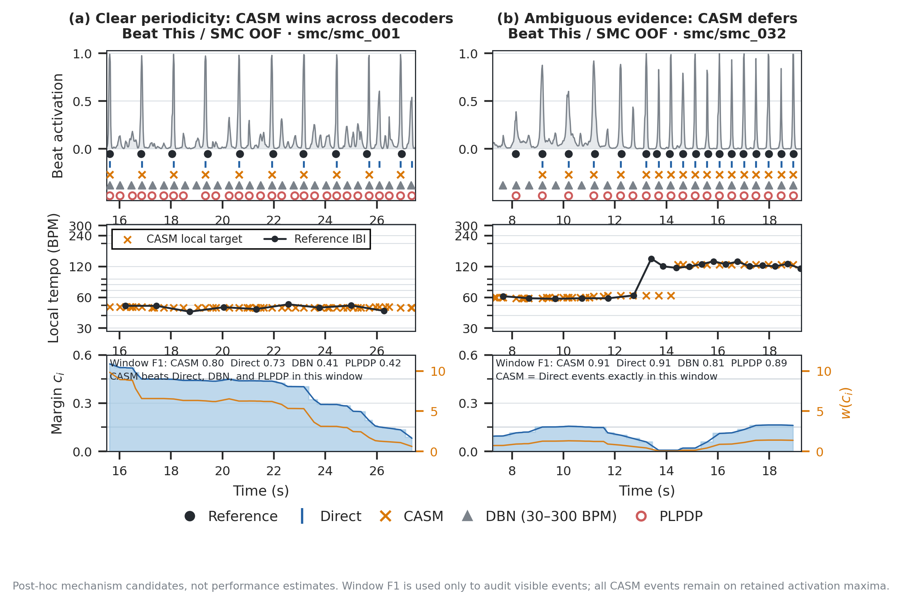
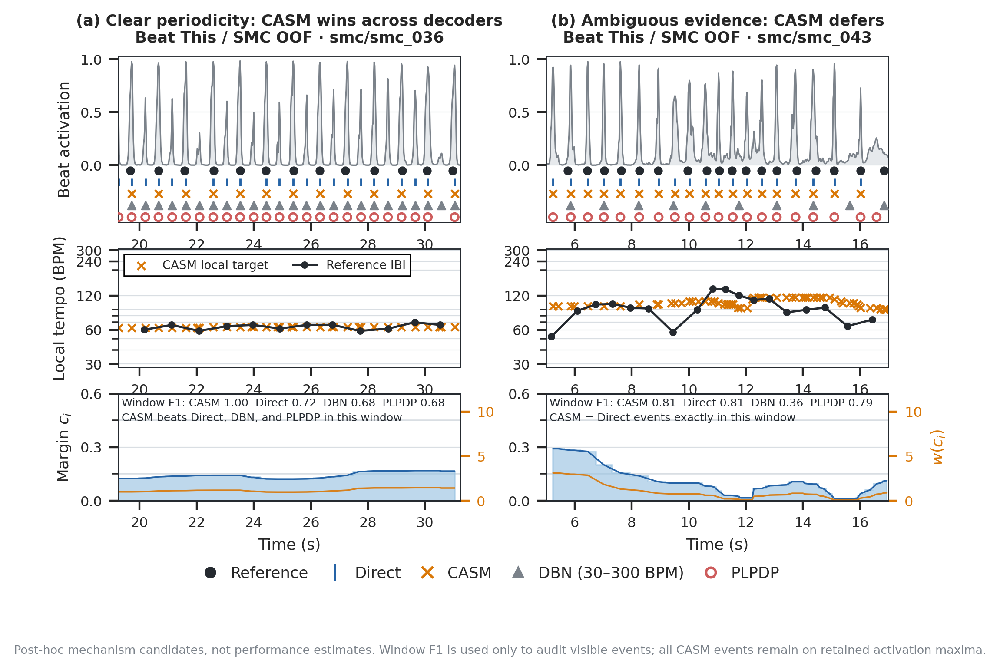

# Fig. 02b Frozen-7F 候选复核

## 结论先行

旧 `fig02b` 的曲线没有标错。问题在于旧选样器只优化 **CASM 相对 Direct** 的增益，没有把 DBN 和 PLPDP 纳入筛选：

- `smc_037` 的原窗口中，F1 为 CASM `.857`、Direct `.625`，但 DBN 和 PLPDP 都是 `.909`；它只能说明 CASM 改善了 Direct，不能说明 CASM 优于另外两个结构化 decoder。
- `smc_287` 的原窗口中，CASM、Direct、DBN、PLPDP 全部约为 `.976`；CASM 的确 defer 了，但所有输出几乎完全重叠，视觉信息很弱。
- 原图还属于历史 Frozen-4F（`duration_sigma=0.12`），而当前论文 release 锁定的是 Frozen-7F（`duration_sigma=0.15`）。因此不能只替换旧图中的 track 名称，必须在 Frozen-7F 下重新解码和筛选。

这次已经按 Frozen-7F 对 Beat This / SMC 8-fold OOF 的全部 217 首重新解码（193 首 non-fallback、24 首 fallback），并以 0.25 s 步长扫描所有 12 s 窗口。得到 20 个 clear 候选、20 个 ambiguous 候选，并从中组合了 11 组 a/b 图供最终选择。

## 我建议优先看的三组

### 首选：I（`smc_001` + `smc_032`）

[PNG](../../self-run-figures/figures-20260904-1443/figures/fig02b-candidates-7f/fig02b_candidate_I.png) · [PDF](../../self-run-figures/figures-20260904-1443/figures/fig02b-candidates-7f/fig02b_candidate_I.pdf) · [SVG](../../self-run-figures/figures-20260904-1443/figures/fig02b-candidates-7f/fig02b_candidate_I.svg)

- Clear：`smc_001`, 15.50–27.50 s。窗口 F1 为 CASM `.800`、Direct `.727`、DBN `.410`、PLPDP `.421`。CASM 抑制 Direct 的额外 peaks，而 DBN/PLPDP 的倍速输出非常直观；median margin `.437`，median stiffness `6.20`。
- Ambiguous：`smc_032`, 7.25–19.25 s。reference tempo 约从 60 BPM 转到 120 BPM，转折处 margin 接近 0；CASM 与 Direct 的事件数组逐点完全相同，窗口 F1 均为 `.914`，DBN `.810`、PLPDP `.895`；median margin `.120`，median stiffness `.95`，整轨 count ratio `.968`，并且明确不是 fallback。
- 这组同时给出了最清楚的 high-confidence / low-confidence 权重反差、CASM 相对三种 comparator 的窗口优势，以及真正的“歧义时不改 Direct”。这是当前的正式首选。

### 次选：G（`smc_036` + `smc_043`）

[PNG](../../self-run-figures/figures-20260904-1443/figures/fig02b-candidates-7f/fig02b_candidate_G.png) · [PDF](../../self-run-figures/figures-20260904-1443/figures/fig02b-candidates-7f/fig02b_candidate_G.pdf) · [SVG](../../self-run-figures/figures-20260904-1443/figures/fig02b-candidates-7f/fig02b_candidate_G.svg)

- Clear：`smc_036`, 19.25–31.25 s。窗口 F1 为 CASM `1.000`、Direct `.722`、DBN `.684`、PLPDP `.684`。CASM 的橙色叉几乎逐点对齐 reference，而其他 decoder 的倍速/额外 beat 很直观。
- Ambiguous：`smc_043`, 5.00–17.00 s。CASM 与 Direct 的事件数组逐点完全相同；窗口 F1 都是 `.811`，DBN `.357`、PLPDP `.789`。局部 tempo target 与 reference IBI 明显不稳定，margin 均值仅 `.089`，因此“证据含混时不强行改写 activation peak”的故事最直观。
- 这组的 clear 输出差异最戏剧化；缺点是 clear margin `.142` 与 ambiguous margin `.089` 的反差没有 I 大。

### 第三选择：B（`smc_001` + `smc_140`）

[PNG](../../self-run-figures/figures-20260904-1443/figures/fig02b-candidates-7f/fig02b_candidate_B.png) · [PDF](../../self-run-figures/figures-20260904-1443/figures/fig02b-candidates-7f/fig02b_candidate_B.pdf) · [SVG](../../self-run-figures/figures-20260904-1443/figures/fig02b-candidates-7f/fig02b_candidate_B.svg)

- Clear：`smc_001`, 17.25–29.25 s。CASM/Direct/DBN/PLPDP F1 为 `.778/.636/.368/.378`，margin 均值 `.292`。
- Ambiguous：`smc_140`, 15.00–27.00 s。CASM 与 Direct 完全一致，F1 均为 `.595`；DBN `.242`、PLPDP `.486`，margin 均值 `.097`。
- 这一组的优势是 high-margin 与 low-margin 的数值反差最大，而且两栏里 CASM 都明显优于 DBN/PLPDP；缺点是 `smc_140` 的 tempo target 本身看起来并不十分混乱，ambiguity 主要由底部低 margin 表达。

### 第四选择：A（`smc_036` + `smc_140`）

[PNG](../../self-run-figures/figures-20260904-1443/figures/fig02b-candidates-7f/fig02b_candidate_A.png) · [PDF](../../self-run-figures/figures-20260904-1443/figures/fig02b-candidates-7f/fig02b_candidate_A.pdf) · [SVG](../../self-run-figures/figures-20260904-1443/figures/fig02b-candidates-7f/fig02b_candidate_A.svg)

- 把最强的 clear 可视差异与最强的 ambiguous baseline 差异放在一起。
- 如果最关心“一眼就能看到 CASM 比 Direct、DBN、PLPDP 好”，这组最稳。

## 十一组候选总览

下表中的 F1 顺序统一为 `CASM / Direct / DBN(30–300) / PLPDP`。所有 ambiguous 窗口都满足：非 fallback、低 margin、CASM 与 Direct 的事件时间数组逐点完全相同。

| 组 | Clear sample（窗口、mean margin、F1） | Ambiguous sample（窗口、mean margin、F1） | 主要取舍 |
|---|---|---|---|
| A | `smc_036`, 19.25–31.25, `.142`, `1.00/.72/.68/.68` | `smc_140`, 15.00–27.00, `.097`, `.59/.59/.24/.49` | 两栏相对 baselines 的差异最强 |
| B | `smc_001`, 17.25–29.25, `.292`, `.78/.64/.37/.38` | `smc_140`, 15.00–27.00, `.097`, `.59/.59/.24/.49` | margin 对比最强 |
| C | `smc_001`, 17.25–29.25, `.292`, `.78/.64/.37/.38` | `smc_043`, 5.00–17.00, `.089`, `.81/.81/.36/.79` | ambiguous 的 tempo 冲突更明显 |
| D | `smc_098`, 6.50–18.50, `.181`, `.80/.70/.51/.67` | `smc_032`, 8.25–20.25, `.117`, `.95/.95/.84/.90` | 两栏 absolute F1 都较高 |
| E | `smc_011`, 14.25–26.25, `.237`, `.91/.84/.72/.77` | `smc_227`, 16.75–28.75, `.118`, `.96/.96/.75/.92` | 整体较平衡，但 Direct 差距较小 |
| F | `smc_221`, 18.25–30.25, `.299`, `.73/.64/.50/.55` | `smc_005`, 15.75–27.75, `.136`, `.59/.59/.43/.43` | 另一组强 margin 对比 |
| G | `smc_036`, 19.25–31.25, `.142`, `1.00/.72/.68/.68` | `smc_043`, 5.00–17.00, `.089`, `.81/.81/.36/.79` | clear 输出差异最戏剧化 |
| H | `smc_001`, 17.25–29.25, `.292`, `.78/.64/.37/.38` | `smc_167`, 13.00–25.00, `.160`, `.62/.62/.47/.50` | ambiguous 整曲 CASM/Direct F1 与 CMLt 都相等，但局部 margin 对比稍弱 |
| I | `smc_001`, 15.50–27.50, median `.437`, `.80/.73/.41/.42` | `smc_032`, 7.25–19.25, median `.120`, `.91/.91/.81/.89` | **首选：置信度/权重反差与可视结果兼顾最佳** |
| J | `smc_042`, 19.00–31.00, median `.485`, `.89/.84/.57/.59` | `smc_032`, 7.25–19.25, median `.120`, `.91/.91/.81/.89` | stiffness 反差最大，但 clear 中相对 Direct 只高 4.7 pp |
| K | `smc_001`, 15.50–27.50, median `.437`, `.80/.73/.41/.42` | `smc_022`, 5.75–17.75, median `.101`, `.92/.92/.52/.88` | absolute F1 高，但 ambiguous 的错误 tempo hypothesis 不如 I 醒目 |

全部候选文件位于：

- [`fig02b-candidates-7f/`](../../self-run-figures/figures-20260904-1443/figures/fig02b-candidates-7f/)
- [候选组合定义](../../self-run-figures/figures-20260904-1443/data/fig02_candidate_search_7f/pairs.json)
- [逐窗口审计表](../../self-run-figures/figures-20260904-1443/data/fig02_candidate_search_7f/candidate_audit.csv)
- [11 组实际绘图窗口与复算指标](../../self-run-figures/figures-20260904-1443/data/fig02_candidate_search_7f/gallery_summary.json)
- [完整选择与 provenance manifest](../../self-run-figures/figures-20260904-1443/data/fig02_candidate_search_7f/manifest.json)

## 筛选约束

Clear 窗口必须同时满足：

1. 不是 safeguard fallback；
2. 至少包含 6 个 reference beats；
3. CASM 窗口 F1 至少为 `.55`；
4. CASM 窗口 F1 同时高于 Direct、DBN default、DBN 30–300 和 PLPDP 至少 2.5 pp。

Ambiguous 窗口必须同时满足：

1. 不是 safeguard fallback；
2. CASM 与 Direct 的窗口事件时间数组逐点完全相同，而不只是恰好取得相同 F1；
3. mean 和 median period margin 都不超过 `.16`；
4. CASM/Direct 的窗口 F1 至少为 `.35`；
5. 相对两种 DBN 和 PLPDP，窗口 F1 不低于 1 pp 以上。

这里仍然是 **post-hoc mechanism visualization**，不是 aggregate performance evidence。论文里 CASM 的总体优劣应由全数据集表格和预先锁定的正式实验支撑；这张图只负责回答“为什么有时改、为什么有时不改”。

## Frozen-7F provenance

- family：`exhaustive_7f`
- configuration hash：`c3311ff6a0bfa0d0344838fdc923b7627ccbe32332a2fb9f17664c2804eca22a`
- selected candidate / frozen-parameter hash：`93f40ad87602ae68d84c6d1d72e307c27a67cc94d2b508f619f3376df08ae7de`
- `duration_sigma=0.15`
- 搜索脚本：[search_fig02_candidates.py](../../self-run-figures/figures-20260904-1443/search_fig02_candidates.py)
- 绘图脚本：[plot_fig02_candidate_gallery.py](../../self-run-figures/figures-20260904-1443/plot_fig02_candidate_gallery.py)

在最终选择某一组之前，没有覆盖论文当前的 `fig02b.{png,pdf,svg}`。
