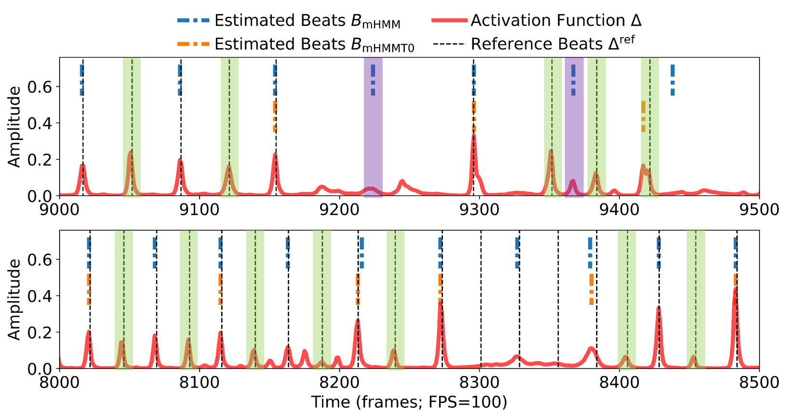
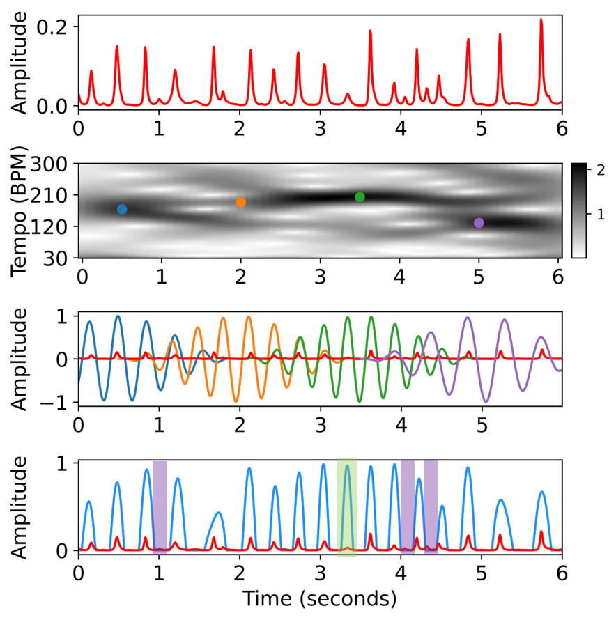
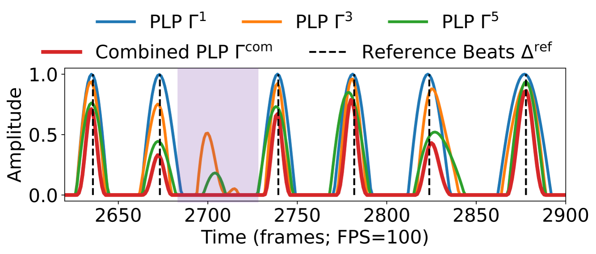
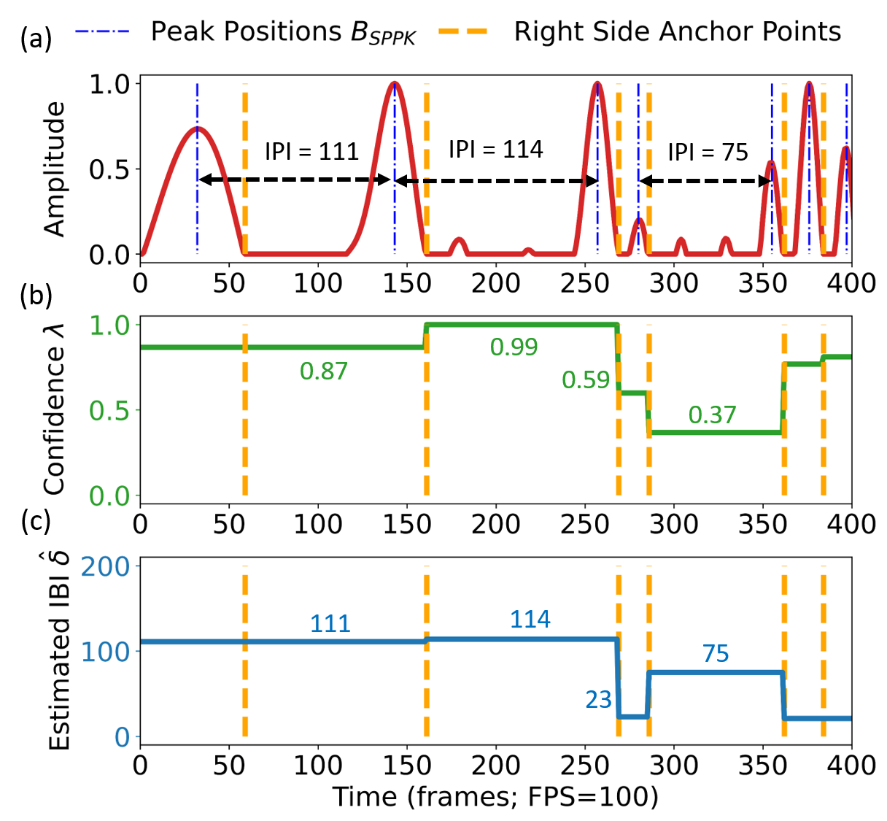
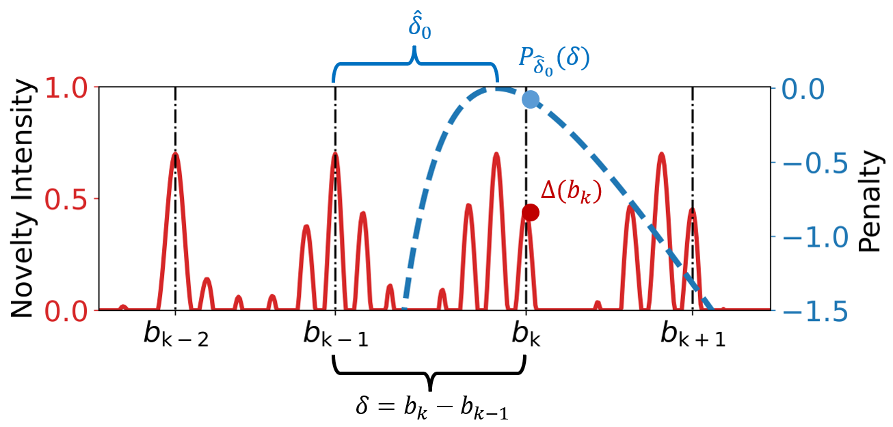
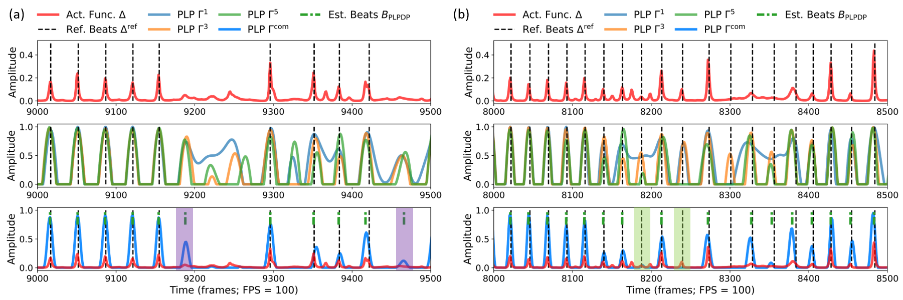
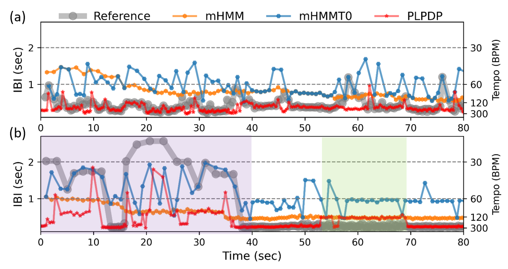
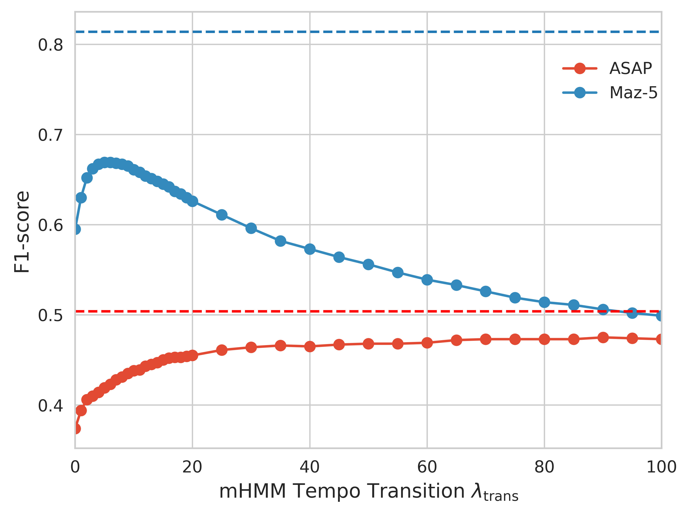

# 基于局部周期性的表现性古典钢琴音乐节拍跟踪

**原文题目：** Local Periodicity-Based Beat Tracking for Expressive Classical Piano Music  
**作者：** Ching-Yu Chiu、Meinard Müller、Matthew E. P. Davies、Alvin Wen-Yu Su、Yi-Hsuan Yang

## 摘要

为了对节拍的周期性进行建模，当前最先进的节拍跟踪系统采用“后处理跟踪器”（post-processing tracker，PPT）；这类跟踪器依赖若干凭经验确定的全局速度转移假设，对速度稳定的音乐效果良好。然而，对于表现性古典音乐而言，这些假设可能过于僵硬。我们在两个大型西方古典钢琴音乐数据集——对齐乐谱与演奏（Aligned Scores and Performances，ASAP）数据集，以及肖邦《玛祖卡舞曲》数据集（Maz-5）——上进行实验，结果表明现有 PPT 无法妥善处理局部速度变化，因此需要新的方法。本文提出一种新的、基于局部周期性的 PPT，称为“主导局部脉冲动态规划”（predominant local pulse-based dynamic programming，PLPDP）跟踪器，它允许更加灵活的速度转移。具体而言，这一新 PPT 将“主导局部脉冲”（predominant local pulses，PLP）方法与动态规划（dynamic programming，DP）组件相结合，在每个时间点联合考虑局部检测到的周期性与节拍激活强度。因此，PLPDP 所依据的是局部周期性，而非全局速度假设。与现有 PPT 相比，PLPDP 尤其提高了召回率，代价是精确率有所下降；总体上，它提升了 ASAP（F1 从 0.473 提高到 0.493）和 Maz-5（F1 从 0.595 提高到 0.838）上的节拍跟踪 F1 分数。

**关键词：** 节拍跟踪、表现性音乐、后处理跟踪器

## I. 引言

节拍通常指听者会随之打拍的一系列感知脉冲，处于时间层级之上，是理解音乐的基础 [1], [2]。感知节拍的能力不仅使我们能够跟随音乐，也是分解、重构音乐或与音乐互动的基础。从计算角度来看，多种下游应用都与节拍跟踪有关，并可借此得到增强 [3], [4]。

现有节拍跟踪系统主要由两部分组成。首先，新颖度检测模块生成所谓的“新颖度函数”（有时也称“激活函数”）：这是一条连续值曲线，用于捕捉随时间变化的能量或频谱变化，从而揭示节拍候选点。其次，后处理跟踪器（PPT）对节拍是否出现给出最终的二元判定 [5]-[7]。传统的基于模型的系统通常基于起音检测方法推导新颖度函数 [8]-[12]；较新的基于深度学习（DL）的系统则采用特征学习网络，直接从音频信号计算激活函数，以表明每个时间点出现节拍的可能性。由于现有新颖度检测方法无法很好地处理节拍时刻的周期性 [13]，现有节拍跟踪系统通常依赖具有周期性感知能力的 PPT 来确定节拍位置。受 [6], [14] 的设计启发，大多数现有 PPT 都是状态空间模型（详见第 II-B 节），例如动态贝叶斯网络（DBN）、隐马尔可夫模型（HMM）[6], [13], [14]、条件随机场（CRF）[15] 或粒子滤波 [16]。

基于 DL 的节拍跟踪系统在速度稳定的音乐上取得了巨大成功，尤其是在流行、摇滚和舞曲上 [6], [7], [17]。然而，可能由于公开可用数据稀缺，最先进的 DL 节拍跟踪器在表现性古典音乐上的性能很少得到讨论；即使有所报告，也远不能令人满意。具体而言，最先进的 DL 系统在古典音乐节拍或强拍跟踪上的性能，往往比其他音乐类型低 20%-30% [18]-[20]。本文旨在找出这种低性能背后的原因，同时改进表现性古典音乐的节拍跟踪。

表现性古典音乐节拍跟踪的挑战与新颖度函数的性质密切相关 [21], [22]。例如，由于速度、节奏或音符密度发生显著变化，新颖度函数可能会变得非周期；对于小提琴或歌声等非打击类乐器，由于音符起音模糊、音符过渡柔和，其强度可能会减弱。另有一种假设认为，可以使用更大规模的古典音乐训练集来提高古典音乐节拍跟踪的准确率 [18], [23]。作为本文的一项贡献，我们在两个大型表现性古典钢琴音乐数据集——肖邦《玛祖卡舞曲》（Maz-5）[21] 和对齐乐谱与演奏（ASAP）数据集 [24]——上开展实验，并表明首先需要解决与 PPT 有关的根本问题。

**图 1.** 最先进的 madmom 深度学习系统对两段古典音乐录音的节拍跟踪结果：上图来自 Maz-5 [21]，下图来自 ASAP [24]。红色表示激活函数（帧率 FPS = 100）。绿色阴影标出存在激活峰值却漏检的假阴性估计；紫色阴影标出由非节拍激活峰值造成的假阳性估计。彩色查看效果最佳。

图 1 展示了使用 madmom 库 [6], [17] 中的系统，对两段古典音乐录音进行节拍跟踪的结果：一段来自 Maz-5，另一段来自 ASAP。该系统使用循环神经网络（RNN）集成来估计节拍激活函数，并使用基于 HMM 的 PPT [14] 来保证所检测节拍的周期性。如前所述，现有节拍跟踪 PPT 大多紧密沿用 madmom 库中的基于 HMM 的 PPT [6], [14]。因此，我们采用该 PPT 作为主要基线模型之一，并使用 madmom 的默认（且被广泛使用的）参数设置。下文将该 PPT 记作“mHMM”。此外，我们还考虑 mHMM 的一个更灵活版本：调整其参数设置，使速度转移的可能性更高，并将其称为“mHMMT0”（详见第 IV-B 与 IV-C 节）。从参考节拍（即真实标注）可以看出，两段录音具有不同程度的速度变化。还可以看到，该系统出现了许多假阳性和假阴性；其成因不仅包括节拍激活函数不完善（例如在非节拍位置出现激活峰值），也包括基于 HMM 的 PPT。对两段录音，mHMM 都假设存在相对稳定（且较慢）的速度，因此忽略了与真实节拍位置相对应的局部激活峰值。mHMMT0 的结果中也能观察到类似的检测错误。此外，我们的分析（见第 IV-D 节）表明，即使使用根据参考节拍合成的、完美的预言式激活函数，在 Maz-5 的 301 段录音上，基于 mHMM 的估计所获得的平均 F1 分数仍低于 0.80。这说明 PPT 采用了某些不适用于表现性音乐的速度假设。

认知神经科学研究发现，人脑通常更关注局部事件（例如一个较短时间窗内的音乐起音），并不断尝试预测即将到来的信息 [25]。在给定若干音乐起音事件后，我们可能会开始对随后到来的事件形成预期 [26]-[28]。这些预期会根据预期与后续事件之间的一致性而被调整、强化或放弃。这类“时间预期”可能是人类能够在一定程度上自适应地处理音乐中的速度变化、切分音，以及节拍位置上的休止音的原因之一。

基于上述观察，我们开发了一种新的 PPT 方法，用来模拟从节拍激活函数中计算出的时间预期。具体而言，我们建议使用一种称为“主导局部脉冲”（PLP）的特征 [8], [29], [30]（详见第 III 节），从节拍激活函数中估计局部周期信息（类似于时间预期）。PLP 曲线被转换为两条曲线：一条包含局部脉冲间隔（IPI）信息，另一条包含局部周期性检测的置信度。随后，我们提出一种新的基于动态规划（DP）的 PPT，将这两条曲线作为随时间变化的速度条件来跟踪节拍。我们在 Maz-5 和 ASAP 上同时使用真实激活函数与合成激活函数进行定量实验（第 V 节），证明了这一名为“PLPDP”的新 PPT 方法相较于代表性现有 PPT，在跟踪具有连续速度变化的表现性音乐节拍时所具备的优势。我们也指出了 PLPDP 有待在未来工作中进一步解决的一些局限（第 VI 节）。[^1]

[^1]: 为保证可复现性，我们在 <https://github.com/SunnyCYC/plpdp4beat/> 提供 PLPDP 的开源代码，并在 <https://sunnycyc.github.io/plpdp4beat-demo/> 提供展示节拍跟踪结果示例的项目网页。

## II. 相关工作

### A. 表现性古典音乐的节拍与速度

针对具有大幅速度变化的古典音乐开展节拍跟踪研究，可以追溯到二十年前 [2], [31]。不过，直到 Grosche 等人 [8], [21] 的工作出现之后，才有了规模更大的评估。在他们的第一篇论文 [21] 中，作者讨论了五种会给节拍跟踪带来问题的音乐属性，随后进行了系统实验，对最先进节拍跟踪器的局限进行了分析和明确说明。由于当时的节拍跟踪系统更加依赖底层新颖度函数的质量，该工作阐明了不同音乐属性对新颖度检测的影响，但没有明确研究音乐属性对 PPT 性能的影响。在论文 [8] 中，作者提出主导局部脉冲（PLP）的概念，并将其用于建模基于模型的起音新颖度函数的局部周期性。具体而言，PLP 通过分析小时间窗内的起音峰值，提取并增强输入新颖度函数的局部周期性；这启发了本文的核心思想（见第 III 节）。经 PLP 增强的新颖度函数可以与基于动态规划（DP）的 PPT 结合，例如 Ellis [1] 所提出的方法。然而，由于假设整体速度恒定（见第 II-B 节），基于 DP 的 PPT 无法处理强烈的速度变化。

最近，受 Böck 等人 [6], [17] 的工作启发，研究者提出了多种基于 DL 的特征学习网络 [7], [32]。此外，由于 DL 模型通常需要大量训练数据，而具有节拍标注的古典音乐数据很难获得，只有少数研究处理与古典音乐相关的节拍跟踪任务。例如，Schreiber 等人 [23] 率先使用基于 DL 的方法对 Maz-5 的局部速度进行建模。具体而言，他们将若干节拍聚合成更高层级的局部速度表示，并将该局部速度表示作为 DL 模型的目标。换言之，他们的工作旨在估计局部速度，而不是预测单个节拍。

### B. 带有全局速度假设的 PPT

Ellis [1] 提出的基于动态规划的节拍跟踪器（DP）是一种被广泛使用的 PPT，我们将其作为评估基线。DP 方法假设乐曲大致以恒定速度演奏，并假设节拍位置处的激活值较高。DP 引入一个分数，联合衡量输入新颖度函数与这两个假设的契合程度，并通过动态规划算法在全局范围内寻找使该分数最大化的最佳节拍序列。基于恒速假设，该方法使用一个全局速度值来平衡目标节拍间隔（IBI）与估计 IBI 之间的一致性（详见第 III-D 节）。这个全局速度值既可以根据参考节拍的平均 IBI 得出 [8]，也可以通过基于自相关的速度估计方法获得 [1], [33]。

恒速假设虽然赋予 DP 简洁的公式与实现，却也限制了 PPT 的灵活性。为了对速度与节拍进行联合建模，Krebs 等人 [14] 扩展了“乐曲小节指针模型” [34], [35]，提出精细化的状态空间离散化方法与速度转移模型。他们的主要贡献包括：设计一种状态空间离散化模型，为每个隐状态保证足够的速度分辨率，并在不同速度的隐状态之间维持时间分辨率的一致性；以及提出一种基于一阶马尔可夫假设的新转移模型，提高速度轨迹的稳定性。具体而言，他们提出一种仅允许在节拍位置发生速度转移的转移模型，从而提高速度稳定性，并凭经验采用指数分布函数作为速度转移似然函数（详见第 IV-B3 节）。

由于这类方法既降低了计算成本，又优于原始模型，现有主流 PPT [6], [13], [15], [16], [36], [37] 大多受到 [14] 的启发。这些 PPT 的优化机制 [36] 或所使用的额外信息（例如节拍相位 [13] 或拍号 [6]）可能不同，但它们通常都基于一阶马尔可夫假设，采用相似的、凭经验确定的速度转移似然函数。

我们注意到，在节奏转写的相关研究中，研究者也会应用基于 HMM 的方法，以输入信号为依据，估计所有音符的节拍位置。尤其是，这些工作也采用类似的一阶马尔可夫假设与速度转移概率分布 [38]-[40]。尽管这些模型对局部速度和局部速度变化进行了参数化，其参数仍是在不了解本文所提出的“局部周期性”（后者基于较小的局部时间窗显式提取）的情况下，以全局方式（例如基于整个数据集）确定的。由于本文聚焦于表现性古典钢琴音乐的节拍跟踪，我们仅讨论为节拍跟踪提出的 HMM，而不讨论用于节奏转写的 HMM。

## III. 基于 PLPDP 的 PPT

本节给出所提出的、基于 PLPDP 的 PPT 的详细内容。我们首先介绍 PLP 概念 [8], [29], [30]，然后阐述 PLP 与人类时间预期之间的相似性。接下来，我们介绍一种减少 PLP 曲线在速度变化区域产生伪影的方法。随后，我们说明如何从 PLP 函数中导出反映局部时间预期及其置信度的速度相关信息。最后，我们给出一种算法，将 DP 与这两个速度相关条件相连接，以实现基于 PLPDP 的 PPT。

### A. 将 PLP 视作局部时间预期

如第 I 节所述，我们发现，PLP 原本是为建模并增强音乐起音新颖度函数的周期性而提出的方法 [8]，但它表现出的行为与人类时间预期颇为相似 [41]。图 2 展示了在给定预先计算的新颖度函数时，PLP 的计算过程及其“时间预期”。PLP 的主要思想是：基于局部周期性假设，生成与给定新颖度曲线对齐的周期脉冲。实现方法是，将新颖度曲线与带窗正弦核进行局部比较，并随时间累积所有最能捕捉新颖度函数局部峰值结构的最优正弦核。

**图 2.** PLP 计算流程示意图。(a) 从一段录音计算得到的新颖度函数（红色曲线；为了对齐比较，也以较小振幅绘于 (c) 和 (d) 中）。(b) 傅里叶速度图，其中四个彩色圆点表示 (c) 中最优正弦核所对应的时间位置。(c) 四个不同时间位置上的最优正弦核。(d) 通过重叠相加与半波整流得到的 PLP（蓝色曲线）。紫色阴影标出被 PLP 抑制的新颖度峰值；绿色阴影标出被 PLP 增强的新颖度峰值。

具体而言，PLP 的计算首先通过短时傅里叶变换（STFT），在某个预先确定的速度范围内（例如每分钟拍数 $θ \in [30:300]$，单位 BPM）计算“傅里叶速度图” [42]（参见图 2b）。随后，在给定 STFT 参数、核大小 $κ$ 与跳步大小 $h$ 的预定取值后，可从速度图及底层复数值傅里叶系数中，导出每个时间点处最优正弦核的主导速度与相位信息 [43]。例如，图 2c 展示了 $κ=3$ 秒时四个时间位置上的最优正弦核。最后，通过重叠相加和半波整流（仅保留曲线的正值部分）得到 PLP 曲线。

请注意，PLP 的峰值以某种方式表明了它对于新颖度峰值是否存在的“预期”（例如，图 2d 中 PLP 峰值如何与新颖度函数的峰值对齐）。即使有些新颖度峰值较低，只要局部检测到的周期性置信度较高，PLP 仍会生成较强的峰值（见图 2d 中绿色阴影下的峰值）。这与人类能够基于时间预期，仍在弱音符甚至休止音上打拍相似。此外，不符合所检测局部周期性的新颖度峰值会受到抑制（见紫色阴影所示区域）。另外，如图 2d 所示，当相邻音乐事件的周期性不一致时，PLP 峰值更低（即置信度更低）。受人类能够自适应地调整对于当前与未来事件的预期和置信度这一能力启发，我们把 PLP 的思想纳入节拍跟踪器，以模拟这种能力。

### B. PLP 曲线及其组合

PLP 函数的“局部敏感性”很大程度上取决于核大小 $κ$ 的选择。令 $Γ_\kappa:[1:N]\rightarrow[0,1]$ 表示核大小为 $κ$（单位为秒）的 PLP 函数，其中 $[1:N]:=\{1,2,\ldots,N\}$，$N\in\mathbb{N}$；该集合表示相对于固定采样率的采样时间轴。在实验中，我们使用每秒 100 帧的速率。

**图 3.** 不同核大小 $κ=1$（蓝）、$κ=3$（橙）、$κ=5$（绿）时的 PLP 函数，以及组合后的 PLP 函数（红）；这些函数以根据参考节拍 $Δ_{\mathrm{ref}}$（竖直虚线）生成的预言式新颖度函数为输入。紫色阴影标出速度/IBI 变化较大的区域；组合 PLP 函数抑制了各单独 PLP 函数在此区域内的多余峰值。彩色查看效果最佳。

图 3 以根据参考节拍生成的预言式新颖度函数 $Δ_{\mathrm{ref}}:[1:N]\rightarrow[0,1]$ 为输入，展示了三种不同核大小 $κ\in\{1,3,5\}$ 对应的 $Γ_\kappa$。[^2] 可以看到，在速度相对稳定的区域，采用不同核大小的 PLP 曲线通常对峰值位置具有相似的“时间预期”，但置信度（即峰值高度）不同。然而，在速度变化较大的区域，这三个 PLP 函数表现并不一致（例如图 3 紫色阴影区域）。由于基于不同核大小的 PLP 曲线通常在不同时间位置产生伪影，我们发现，对这些 PLP 曲线做逐元素乘法，是一种简单而有效的伪影削减方式。因此，定义组合 PLP 函数 $Γ_{\mathrm{com}}$ 为

$$
\Gamma_{\mathrm{com}}(n):=\Gamma_1(n)\cdot\Gamma_3(n)\cdot\Gamma_5(n), \tag{1}
$$

其中 $n\in[1:N]$。

[^2]: PLP 的输入既可以是真实新颖度函数，也可以是合成新颖度函数（参见第 IV-C 与 IV-D 节）。此处使用根据参考节拍生成的合成函数（详见第 IV-D 节），以展示 PLP 对速度变化的敏感性。

### C. 将 PLP 视作速度相关条件

PLP 函数给出的峰值位置会与输入新颖度函数中的峰值对齐，而峰值高度可以被视为一种置信度度量。为了获得与局部速度有关的信息，我们提出以下过程：将一个 PLP 函数转换为表示置信度的分段常数函数 $λ$，以及编码节拍间隔（IBI）的分段常数函数 $\hat{\delta}$。

**图 4.** 将一个 PLP 函数转换为置信度分段常数函数 $λ$ 与估计 IBI 分段常数函数 $\hat{\delta}$。(a) 使用所检测峰值的右侧锚点，将 PLP 函数划分为若干分段。(b) 从峰值高度导出的置信度函数。(c) 从峰间间隔（IPI）导出的估计 IBI 函数 $\hat{\delta}$。

如图 4 所示，我们首先对 PLP 使用简单峰值选取函数（SPPK）[^3]，得到峰值位置列表 $B_{\mathrm{SPPK}}=(b_1,b_2,\ldots,b_K)$（图 4a 中蓝线）。然后，在与这些峰值右侧锚点相对应的时间点（竖直橙线）处，把 PLP 划分为若干分段。[^4] 对每一个分段，我们计算峰间间隔（IPI），并将该段内所有帧 $n$ 的 $\hat{\delta}(n)$ 设为这一数值，见图 4c。类似地，我们将 $λ(n)$ 定义为该分段两个 PLP 峰值高度的平均值。下面将说明，所得到的置信度与估计 IBI 两个函数，如何供 PPT 用于跟踪表现性音乐中的节拍。

[^3]: 在实现中，我们采用 `scipy.signal.find_peaks` [44]，参数设置为 `height = 0.1`、`distance = 7`、`prominence = 0.1`。七帧的距离值与节拍跟踪评估的容差窗大小（即 70 ms）相对应；另两个值均设为 0.1，以保证峰值具有基本的高度与显著性。

[^4]: 尽管可能存在其他更复杂的方法，我们选择了这种简单的启发式方法，即在 PLP 曲线的峰值右侧锚点（也就是峰后曲线降至较低值的位置）对其进行分段。

### D. PLP 与 DP 的结合

[1] 中提出的、基于 DP 的节拍跟踪器旨在寻找最优节拍序列 $B^*$，使一个在新颖度强度与速度一致性之间取得平衡的分数函数 $C$ 最大化。令 $B=(b_1,b_2,\ldots,b_K)$ 为按时间顺序排列的估计节拍位置序列。分数函数 $C$ 定义为

$$
C(B):=\sum_{k=1}^{K}\Delta(b_k)+\lambda_0\sum_{k=2}^{K}P_{\hat{\delta}_0}(b_k-b_{k-1}), \tag{2}
$$

其中，$Δ$ 表示新颖度函数，$\lambda_0\in\mathbb{R}_{\geq0}$ 表示用于平衡新颖度函数与速度一致性条件相对重要性的因子。此外，$P_{\hat{\delta}_0}:\mathbb{N}\rightarrow\mathbb{R}$ 表示相对于预先指定 IBI $\hat{\delta}_0\in\mathbb{N}$ 的速度一致性惩罚函数，定义为

$$
P_{\hat{\delta}_0}(\delta):=-\left(\log_2\left(\frac{\delta}{\hat{\delta}_0}\right)\right)^2, \tag{3}
$$

其中 $δ=b_k-b_{k-1}$。请注意，当 $δ\approx\hat{\delta}_0$ 时，$P_{\hat{\delta}_0}(\delta)$ 较大；当 $δ$ 取更小或更大的值时，它会减小。图 5 展示了 $P_{\hat{\delta}_0}$ 以及分数函数 $C$ 的定义。

**图 5.** 式 (2) 所定义的分数函数 $C(B)$ 的示意图；它联合展示新颖度函数强度 $Δ(b_k)$ 与速度一致性惩罚函数 $P_{\hat{\delta}_0}(\delta)$。

原始 DP [1], [45], [29, 第 6.3.2 节] 使用固定 IBI $\hat{\delta}_0$ 与固定因子 $λ_0$。本文提出一种新的、基于 DP 的 PPT，称为 PLPDP；它以新颖度函数 $Δ$ 以及第 III-C 节介绍的随时间变化的 $\hat{\delta}(n)$ 和 $λ(n)$ 为输入。与原始 DP 相比，我们以 $\hat{\delta}(n)$ 替代 $\hat{\delta}_0$，并以 $λ(n)$ 替代 $λ_0$。在 DP 的前向过程中，我们在时间帧 $n$ 计算累积分数 $D(n)$；该分数取决于前序帧 $m\in[1:n-1]$ 的累积分数、相应的速度一致性惩罚，以及当前的新颖度强度：

$$
D(n)=\Delta(n)+\max\left\{0,\max_{m\in[1:n-1]}\left\{D(m)+\lambda(n)P_{\hat{\delta}(n)}(n-m)\right\}\right\}.
$$

与此同时，我们在 $P(n)$ 中保存取得最大值的前驱时间位置。之后，在后向过程中使用 $D(n)$ 与 $P(n)$，导出最优节拍序列 $B^*$。算法 1 给出了 PLPDP 的伪代码。[^5]

**算法 1：PLPDP 节拍跟踪**

**输入**

- 新颖度（激活）函数 $Δ:[1:N]\rightarrow[0,1]$
- 从 PLP 导出的置信度 $λ:[1:N]\rightarrow[0,1]$ 与估计 IBI $\hat{\delta}:[1:N]\rightarrow\mathbb{R}_{\geq0}$

**输出**

- 最优节拍序列 $B^*=(b_1,b_2,\ldots,b_K)$
- 累积分数 $D(n)$
- 前驱信息 $P(n)$

**过程**

1. **前向：** 初始化 $D(0)=0$、$P(0)=0$。随后对 $n=1,\ldots,N$ 循环计算：

   $$
   D(n)=\Delta(n)+\max\left\{0,\max_{m\in[1:n-1]}\left\{D(m)+\lambda(n)P_{\hat{\delta}(n)}(n-m)\right\}\right\}.
   $$

   若 $D(n)=\Delta(n)$，则令 $P(n)=0$；否则令

   $$
   P(n)=\arg\max_{m\in[1:n-1]}\left\{D(m)+\lambda(n)P_{\hat{\delta}(n)}(n-m)\right\}.
   $$

2. **后向：** 令 $k=1$，$a_k=\arg\max_{n\in[0:N]}D(n)$。在 $P(a_k)\neq0$ 时重复：将 $k$ 加一，并令 $a_k=P(a_{k-1})$。若 $a_k=0$，则令 $K=0$ 并返回 $B^*=\varnothing$；否则令 $K=k$，并返回 $B^*=(a_K,a_{K-1},\ldots,a_1)$。

默认情况下，我们将组合 PLP 函数 $Γ_{\mathrm{com}}$ 作为 PLPDP 的输入。为了凭经验验证使用多个核的合理性，我们还在实验中进行消融研究，只使用单一核对应的 PLP 函数 $Γ_3$，并将该变体称为“PLPDP-$\Gamma_3$”。

[^5]: 该算法根据 [29] 第 343 页表 6.1 与 [46] 中的 DP 算法修改而来。

## IV. 实验设置

以下我们报告用于评估已有最先进 PPT 与所提出 PPT 的实验，结果见第 V 节。实验使用两个数据集（Maz-5、ASAP），见第 IV-A 节。此外，我们既考虑根据音频录音计算得到的激活函数（真实使用情形），也考虑根据真实标注得到的激活函数（合成情形）。

### A. 数据集统计

表 I 列出了本研究使用的两个数据集。Maz-5 [21] 是一个私有音乐集合，包括 301 段音频录音，对应肖邦 49 首不同《玛祖卡舞曲》中的五首。这些录音是 Mazurka 项目 [47] 的一部分，并由 Sapp [48] 进行人工标注（节拍位置）。ASAP [24] 是 2020 年新发布的公开数据集，包含 15 位作曲家的 502 段西方古典钢琴音乐演奏。[^6]

**表 I. 实验所用数据集的统计信息**

| 数据集 | 曲目数 | 总时长 | 速度稳定的曲目比例 |
|---|---:|---:|---:|
| Maz-5 | 301 | 12 小时 27 分 | 13.1% |
| ASAP | 502 | 41 小时 45 分 | 24.6% |

表 I 还展示了按照 Schreiber [23] 的方法计算的数据集速度稳定率。具体而言，我们首先将一个数据集中的全部 IBI 转换为速度值，再将这些速度值除以对应曲目的平均速度，得到归一化速度。为了量化录音速度是否稳定，我们采用常用的 $±4\%$ 容差区间 [50]，并计算数据集中归一化速度落在 0.96-1.04 区间内的录音所占比例。表 I 显示，Maz-5 与 ASAP 的速度稳定率分别为 13.1% 和 24.6%，说明两个数据集中很大一部分录音的速度并不稳定。[^7]

[^6]: 本项目进行期间，发布了名为 ACPAS [49] 的数据集，它将 ASAP 与另外 59 段真实古典钢琴演奏录音合并。由于这些录音数量相对较少，我们对它们的分析与评估未纳入本文。

[^7]: 相比之下，据 [23] 报告，在 Ballroom 数据集 [50], [51]——一个被广泛用于节拍与强拍跟踪研究的舞曲集合——中，速度稳定的录音比例达到 90.9%。

### B. 基线/所提出的 PPT

实验中，我们考虑四种基线 PPT（SPPK、DP、mHMM 和 mHMMT0），以及我们的方法 PLPDP 和 PLPDP-$\Gamma_3$。下面将更详细地介绍这些 PPT。

#### 1) 简单峰值选取（SPPK）

该过程使用 SciPy 库 [44] 的 `find_peaks` 函数检测激活函数中的峰值位置。这些峰值被直接作为节拍，不施加任何诸如节拍周期一致性之类的假设，也不对输入做任何校正（例如增强新颖度函数）。

#### 2) DP+GT

如第 III-D 节所述，[1] 中的 DP 需要预先指定 IBI $\hat{\delta}_0$，作为全局速度信息；该值可以通过全局速度检测方法估计 [52]。然而，由于此处重点在于研究 DP 的内在局限，我们使用根据参考节拍位置的平均 IBI 得到的真实（GT）全局速度。请注意，使用 GT 速度值使 DP 相较于其他不知情的 PPT 占据优势，从而避免不完善的全局速度估计造成误差传播。此外，实验将表明，即使能够获得部分 GT 信息，这一 DP+GT 基线在 Maz-5 与 ASAP 上仍会因其内在局限而表现不佳。实验中的 GT 知情 DP 遵循 Grosche 等人 [8] 的设置。[^8]

[^8]: DP 的源代码见 [45]。

#### 3) mHMM 与 mHMMT0

作为另一种基线方法，我们采用 Krebs 等人 [14], [17] 提出的经典 HMM PPT。[^9] 该方法的主要组件是状态空间离散化模型与速度转移模型。给定输入新颖度函数 $Δ:[1:N]\rightarrow[0,1]$ 作为观测序列，待考虑的速度由集合

$$
A:=\{\alpha_1,\alpha_2,\ldots,\alpha_I\} \tag{4}
$$

表示；该集合大小为 $I\in\mathbb{N}$，由 $i\in[1:I]$ 上互不相同的元素 $α_i$ 构成。元素 $α_i$ 称为隐速度状态，由离散化方法和给定速度范围确定。速度转移可以由这样一个系统实现：在任意时间点 $n\in[1:N]$，系统都处于某个速度状态 $\dot{\Psi}_n\in A$。

Krebs 等人 [14] 提出的速度转移模型在大多数时候维持同一速度，仅允许在节拍位置发生速度变化。对于对应节拍位置的时间点 $n$，他们凭经验采用以下指数分布函数作为速度变化似然函数：

$$
f(\dot{\Psi}_n,\dot{\Psi}_{n-1})=\exp\left(-\lambda_{\mathrm{trans}}\cdot\left|\frac{\dot{\Psi}_n}{\dot{\Psi}_{n-1}}-1\right|\right). \tag{5}
$$

其中，速度转移参数 $\lambda_{\mathrm{trans}}\in\mathbb{R}_{\geq0}$ 决定分布的陡峭程度。[^10] 直观而言，较大的 $\lambda_{\mathrm{trans}}$ 会使模型变得僵硬，只允许从一个节拍到下一个节拍发生微小速度变化；相反，接近于零的较小 $\lambda_{\mathrm{trans}}$ 会使转移到所有可能速度的概率几乎相同。

mHMM 在式 (5) 中默认凭经验将速度转移参数取为 $\lambda_{\mathrm{trans}}=100$；这个取值基于对主流流行、摇滚和舞曲的经验观察。我们将默认版本记为 mHMM，更多细节见 [14]。为允许古典音乐中出现大得多的速度变化，我们实现 mHMM 的一个变体，将 $\lambda_{\mathrm{trans}}$ 设为 0，并称之为 mHMMT0。为进一步揭示基于 HMM 的 PPT 的能力与局限，第 V-D 节报告并讨论了对 $\lambda_{\mathrm{trans}}$ 进行网格搜索的实验。

[^9]: 我们采用官方发布的 madmom `DBNBeatTrackingProcessor`，它不考虑输入曲目的拍号。

[^10]: 请注意，mHMM 状态空间的速度离散化 $\dot{\Psi}$ 是非线性的，与第 III-A 节的 $θ$ 不同。细节见 [14]。本文将两个 mHMM 与 PLPDP 的速度范围均设为 30-300 BPM。即 $θ\in[30:300]$；对于 madmom 的 `DBNBeatTrackingProcessor`，取 `(min_bpm, max_bpm) = (30, 300)`。

#### 4) PLPDP 与 PLPDP-$\Gamma_3$

PLPDP 有多种实现选择。例如，可以通过某种方式（如网格搜索）优化跳步大小 $h$、核大小 $κ$，或从 PLP 中提取速度相关条件的设计选择。然而，我们的重点是研究这些基于局部时间信息的方法的一般行为，而非针对某一特定数据集对其进行优化/微调，因此省略此类过程。我们凭经验将组合 PLP（$Γ_{\mathrm{com}}$）的核大小设为 $κ=1,3,5$ 秒，并将其作为 PLPDP 的输入；在消融研究所用的 PLPDP-$\Gamma_3$ 中，则把 PLP（$Γ_3$）的核大小设为 $κ=3$ 秒。对于 $κ=1$，速度范围设为 $[60:300]$ BPM；对于 $κ=3,5$，设为 $[30:300]$ BPM，从而保证每个 PLP 核对于给定范围内的每一种速度，至少能容纳一个完整正弦波。

### C. 真实使用情形

在真实使用情形中，我们以原始音频录音为输入，使用 madmom 的 `RNNDownBeatProcessor` [6], [17]——一种基于 DL 的方法——为每段录音导出节拍激活函数与强拍激活函数（表示每一帧为节拍与强拍的概率）。随后，我们取两个激活函数在每一帧上的最大值，得到一个联合节拍激活函数，并将其作为各种 PPT 的输入。

### D. 合成情形

除根据音频录音计算激活函数之外，我们也考虑一种合成情形：使用从真实节拍标注导出的理想化激活函数。为此，我们以 100 FPS 的帧率将标注转换为具有相同脉冲幅度的脉冲序列。如此得到的输入激活函数是“完美的”：在节拍位置上均取最大强度（设为 $1-\epsilon$），在非节拍位置上取最小值（设为 $ε$）。[^11] 我们预计，在合成激活函数上进行的实验，能够在不受激活函数估计误差影响的情况下，揭示 PPT 对速度稳定性的敏感程度。

[^11]: 为避免使用 madmom API [17] 实现 mHMM 时出现错误警告，需要取一个很小的值 $ε=10^{-6}$。

## V. 实验结果

本节报告真实使用情形与合成情形的实验结果。我们使用 $±70$ ms 的容差窗，计算召回率（R）、精确率（P）和 F 度量（F1）作为性能指标。

### A. Maz-5 上的定量结果

我们首先讨论 Maz-5 数据集。表 II 展示了不同设置下的节拍跟踪结果。

**表 II. Maz-5 数据集上的节拍跟踪结果。每项指标的两个最佳分数以粗体表示**

| PPT | 真实激活 F1 | 真实激活召回率 | 真实激活精确率 | 合成激活 F1 | 合成激活召回率 | 合成激活精确率 |
|---|---:|---:|---:|---:|---:|---:|
| SPPK | **0.822** | 0.754 | **0.918** | **1.000** | **1.000** | **1.000** |
| DP+GT | 0.488 | 0.501 | 0.475 | 0.799 | 0.808 | 0.791 |
| mHMM | 0.499 | 0.393 | 0.753 | 0.794 | 0.872 | 0.732 |
| mHMMT0 | 0.595 | 0.450 | 0.903 | **0.994** | 0.994 | **0.995** |
| PLPDP-$\Gamma_3$ | 0.791 | **0.936** | 0.696 | 0.862 | **1.000** | 0.766 |
| PLPDP | **0.838** | **0.917** | 0.777 | 0.982 | 0.996 | 0.968 |

对于真实激活情形，我们首先观察 SPPK 的结果，以了解 Maz-5 数据集及相应激活函数的性质。由于 SPPK 将所有激活峰值都选为节拍位置，从较高的精确率（P = 0.918）可以推断，大多数激活峰值都对应节拍位置；从召回率（R = 0.754）则可以推断，Maz-5 中有一些峰值缺失。接下来，请注意，基线 PPT（例如 DP 和 mHMM）的 F1 分数几乎都无法超过 0.6；这与参考文献 [6]-[8] 所报告的它们在速度稳定音乐上的优越表现形成鲜明对比。DP 与基于 HMM 的方法的召回率（DP：R = 0.501；mHMM：R = 0.393；mHMMT0：R = 0.450）均低于 SPPK（R = 0.754），进一步表明它们表现不佳主要是因为忽略了激活峰值。此外，DP（P = 0.475）与 mHMM（P = 0.753）的精确率低于 SPPK（P = 0.918），说明 DP 与 mHMM 基于其严格的速度假设，在没有激活峰值的位置插入了节拍估计。

另一方面，PLPDP 的行为与其他 PPT 不同。与 SPPK（R = 0.754）相比，其召回率显著更高（PLPDP-$\Gamma_3$：R = 0.936；PLPDP：R = 0.917），显示“局部时间预期”能够有效补偿节拍位置上缺失的激活峰值。相反，与 SPPK（P = 0.918）相比，PLPDP 的精确率更低（PLPDP-$\Gamma_3$：P = 0.696；PLPDP：P = 0.777），说明 PLPDP 也会基于局部时间预期产生假阳性估计。总体而言，PLPDP 与现有 PPT 之间的上述行为差异造成了显著的 F1 性能差距（PLPDP：F1 = 0.838；mHMMT0：F1 = 0.595；mHMM：F1 = 0.499），表明“局部时间周期性”对 Maz-5 有效。此外，SPPK 较高的 F1 分数（F1 = 0.822）意味着，对于具有高质量激活函数（例如非节拍激活峰值较少）的表现性音乐录音，SPPK 可能取得较高的 F1 分数。

合成情形的结果为上述观察提供了更多认识。请注意，以完美的合成激活函数为输入时，人们可能预期所有 PPT 的 F1 分数均达到 1.0。然而，除 SPPK（唯一不带任何速度相关假设或限制的 PPT）之外，其他 PPT 都未能达到这一水平。从并不完美的召回率与精确率可以看出，DP 与 mHMM 的强全局速度假设不仅会导致激活峰值被丢弃，还会在完全没有激活峰值的区域引入假阳性节拍预测。认识到这些固有局限后，DP 与 HMM 在真实激活实验中的低性能也就不那么令人意外了。

还可以看到，在输入激活完美时，PLPDP 较高的召回率与精确率说明，所提出的方法能够更好地适应 Maz-5 的局部速度变化。因此，PLPDP 比 DP 与 mHMM 更灵活。[^12] 此外，PLPDP 的精确率高于 PLPDP-$\Gamma_3$，说明与单核 PLP 函数相比，组合 PLP 函数是有效的。

[^12]: 也许有人会认为，在 Maz-5 的这一合成情形中，mHMMT0 优于 PLPDP。需要指出的是，合成实验的主要目的是研究每种 PPT 所采用假设的局限。在最灵活的参数设置下，mHMMT0 确实比 PLPDP 更灵活（不过差异小于 1.2%）。然而，这种灵活设置也显著限制了 mHMMT0 在真实（不完美）激活情形中的性能。此外，我们注意到，一旦能够得到最优激活函数（例如基于 DL 的网络真正像人类一样学会了全面的节拍概念），最佳 PPT 始终是 SPPK（即不带任何假设）。

### B. ASAP 上的定量结果

表 III 展示了 ASAP 数据集上的节拍跟踪结果。

**表 III. ASAP 数据集上的节拍跟踪结果。每项指标的两个最佳分数以粗体表示**

| PPT | 真实激活 F1 | 真实激活召回率 | 真实激活精确率 | 合成激活 F1 | 合成激活召回率 | 合成激活精确率 |
|---|---:|---:|---:|---:|---:|---:|
| SPPK | 0.380 | 0.419 | **0.607** | **1.000** | **0.999** | **1.000** |
| DP+GT | 0.450 | 0.458 | 0.443 | 0.903 | 0.913 | 0.894 |
| mHMM | 0.473 | 0.540 | 0.500 | 0.911 | 0.947 | 0.886 |
| mHMMT0 | 0.374 | 0.324 | **0.556** | **0.982** | 0.986 | **0.981** |
| PLPDP-$\Gamma_3$ | 0.488 | **0.732** | 0.404 | 0.829 | **0.997** | 0.750 |
| PLPDP | **0.493** | **0.707** | 0.418 | **0.982** | 0.995 | 0.971 |

从 SPPK 的显著性能变化可以断定，ASAP 与 Maz-5 的性质存在重大差异。召回率（ASAP：R = 0.419；Maz-5：R = 0.754）与精确率（ASAP：P = 0.607；Maz-5：P = 0.918）都大幅下降。这说明，在 ASAP 上，madmom 网络未能在一些节拍位置生成激活峰值，同时又产生了大量虚假的激活峰值。这种差异可能源于数据集本身的性质（例如 ASAP 可能包含更多非节拍音符事件），或源于基于 DL 的 madmom 网络训练不足（未适应 ASAP）。这些观察进一步解释了为何没有任何 PPT 能取得高于 0.50 的 F1 分数，这一点与 Maz-5 的结果不同。回顾表 I，ASAP 的速度稳定性高于 Maz-5。因此，ASAP 的结果表明，节拍跟踪性能不佳也可能是激活函数的性质所致。

尽管上述两个数据集存在差异，仍能观察到 PLPDP 的相似行为模式。PLPDP 的召回率高于其他 PPT，再次说明“局部时间预期”能够有效补偿激活函数在节拍位置缺失的峰值。然而，与 Maz-5 相比，PLPDP 在 ASAP 上的精确率较低；由此可以推断，随着非节拍位置上激活峰值数量增加，PLPDP 与 PLPDP-$\Gamma_3$ 的性能会显著下降。

类似地，ASAP 合成情形的结果支持上述观察。SPPK 在三项指标上都取得完美分数这一显然事实，[^13] 再次反映出 PPT 受到其内在速度假设的限制。比较 Maz-5 与 ASAP 在合成情形中的 F1 分数，还可以看到 DP 与 mHMM 对低速度稳定性十分敏感，在速度更稳定的 ASAP 上表现好得多。相反，PLPDP 对速度变化不那么敏感，在两个数据集上的表现相近。

[^13]: 其召回率并非 1.0，主要是由于 ASAP 的半自动标注过程 [24] 引入的标注错误（即参考节拍彼此过近，因 SPPK 的 `distance = 7` 设置而被排除）。

### C. 定性结果

图 6 展示了 PLPDP 对两个真实激活函数进行节拍跟踪的结果（沿用图 1 的示例）。参考节拍与激活函数（图 6 顶行）体现了前述观察。例如，Maz-5 录音具有更多速度变化，在非节拍位置上出现的激活峰值较少。另一方面，在 ASAP 示例的节拍位置上，可以看到若干微弱或缺失的激活峰值。$κ=1,3,5$ 时的 PLP 函数（图 6 中间一行）进一步揭示了速度变化区域中不同的时间预期。组合 PLP 函数与 PLPDP 的估计节拍（图 6 底行）揭示了局部时间预期的优势与局限。

**图 6.** 所提出的、基于 PLPDP 的 PPT 对图 1 中同两段录音的节拍跟踪结果。(a) Maz-5 示例。(b) ASAP 示例。顶行：madmom 激活函数与参考节拍。中间一行：$κ=1,3,5$ 的 PLP 函数。底行：组合 PLP 函数与 PLPDP 的估计节拍。紫色阴影标出假阳性估计；绿色阴影标出假阴性估计。彩色查看效果最佳。

具体而言，PLPDP 在两个示例中都基于局部时间预期，很好地适应了局部速度变化。然而，如果非节拍位置上存在与局部检测到的周期性相符的激活峰值，这些预期也可能造成假阳性错误，如紫色阴影区域所示。从假阴性错误（绿色阴影区域）可以看到，PLPDP 也可能基于局部时间预期，忽略节拍位置上的激活峰值。不过，只要大多数节拍位置上的激活峰值更强，PLPDP 引入的此类假阴性错误就远少于 mHMM。

图 7 通过绘制节拍间隔（IBI）的演进，展示了各 PPT 在两个示例录音上的较长期行为。具体而言，对于每一个节拍位置序列（例如参考节拍或基于 PPT 的估计节拍），我们纳入节拍位置 $b_i$（横轴，单位为秒）及其对应 IBI（即纵轴上的 $b_{i+1}-b_i$），由此观察录音中参考/估计 IBI 的演进。

**图 7.** 图 1 所用片段对应录音的参考节拍（灰）与估计节拍（蓝：mHMM；橙：mHMMT0；红：PLPDP）的 IBI 演进。(a) Maz-5 录音。(b) ASAP 录音。紫色阴影标出速度缓慢且不稳定的区域；绿色阴影标出速度快速且稳定、但 PPT 未能跟随的区域。

从参考曲线（灰色）可以看到，Maz-5 示例（图 7a）在较快速度下呈现连续的速度变化（即 100-300 BPM，对应 0.2-0.6 秒的 IBI）；ASAP 示例（图 7b）则既有缓慢而不稳定的区域（紫色阴影），也有较快且稳定的区域（绿色阴影）。对两首作品而言，若不显式考虑局部音乐内容，任何全局假设都不太可能奏效。具体来说，由于 mHMM 的速度转移函数以全局方式设置，两个 mHMM 都无法像 PLPDP 那样与参考 IBI 演进对齐。

更多定性结果请参阅项目网页。[^1]

### D. mHMM 速度转移参数 $\lambda_{\mathrm{trans}}$ 的网格搜索

上述实验已经证明了基于 HMM 的 PPT 与所提出的 PLPDP 方法在概念上的差异。现在，我们就 mHMM 的速度转移参数 $\lambda_{\mathrm{trans}}$ 给出一个额外的网格搜索实验，以提供更多认识。图 8 展示了真实激活情形的结果。

**图 8.** 在真实激活实验中，对 mHMM 速度转移参数 $\lambda_{\mathrm{trans}}$ 从 0 到 100 进行网格搜索。$0\leq\lambda_{\mathrm{trans}}\leq20$ 时步长为 1，其余情况步长为 5。水平虚线表示 PLPDP 的结果，以供比较。

对 Maz-5 而言，当 mHMM 的 $\lambda_{\mathrm{trans}}$ 在 1 到 25 之间变化时，其表现优于 mHMMT0；不过，对两个数据集而言，最佳 mHMM 的表现仍不如 PLPDP（水平虚线）。此外，尽管两个数据集都由表现性古典音乐构成，使性能最佳的 $\lambda_{\mathrm{trans}}$ 却不同（Maz-5：$\lambda_{\mathrm{trans}}=5$；ASAP：$\lambda_{\mathrm{trans}}=90$）。因此可以推断，针对每一段录音，甚至录音中的局部片段，调整参数 $\lambda_{\mathrm{trans}}$，可能是提升 mHMM 方法性能的关键。

## VI. 结论与未来工作

本文在改进并深化对表现性古典音乐节拍跟踪的理解方面作出了贡献。第一，我们提出了一种新的、基于局部时间预期的后处理跟踪（PPT）方法。第二，我们通过实验研究了所考虑 PPT 的性能上限。第三，我们对表现性古典音乐的节拍跟踪方法进行了全面评估与分析。所提出的 PLPDP 方法提供了一种将局部速度相关信息纳入节拍跟踪系统的方式。通过考虑局部周期一致性，我们的方法区别于依赖全局确定的速度转移假设的现有 PPT。此外，合成实验展示了研究和探索 PPT 优势与局限的新方法。总体而言，我们希望本工作能够为改进表现性古典音乐节拍跟踪提供一个新的方向。

从 ASAP 的真实激活实验可以看到，PPT 仍有很大的改进空间。在影响节拍跟踪性能的因素中，通过增加用于训练特征学习网络的古典音乐数据，或许可以减少节拍位置上激活峰值缺失的问题。尤其是，这可能显著改进激活函数，使其能够更好地涵盖古典音乐中出现的各种音符起音属性。

然而，仅仅增加训练数据可能无法帮助基于 DL 的网络减少（假阳性的）非节拍激活峰值，而这也构成了节拍跟踪错误的很大一部分，尤其是在 ASAP 上。除了完全依赖起音相关信息之外，我们推测，考虑层级线索的方法或许会有所帮助，例如将音高、旋律等频域信息，或与较长期结构有关的信息纳入考虑。此外，这些按层级组织的音乐与声学线索，也可能帮助未来模型自适应地调整 PLP 核大小。

根据我们对所有所考察 PPT 行为的经验观察，我们发现，这些过程在跟踪一段录音的节拍时，往往会在不同度量层级之间切换（例如参考节拍的一半、三分之一、两倍或三倍速度）。然而，当前评估指标无法反映这种“度量层级切换”行为。我们最近提出了一种分析方法 [53]，以更深入地理解这类问题。更多结果与讨论可见我们的 GitHub 仓库。

最后，由于现有多乐器古典音乐数据集（例如 RWC-Classical [54]）相对较小，实验中仅考虑西方古典钢琴音乐。与钢琴音乐相比，多乐器古典音乐的非节拍位置上可能出现更多起音，而节拍位置的激活强度也可能因为柔和起音而更弱。为了评估 PLPDP 对一般表现性古典音乐的性能，未来工作需要考虑钢琴音乐之外的数据集。

## 参考文献

> 为确保书目信息准确，参考文献的题名、刊名和出版信息按原文保留。

[1] D. P. Ellis, “Beat tracking by dynamic programming,” *J. New Music Res.*, vol. 36, no. 1, pp. 51-60, 2007.

[2] S. Dixon and E. Cambouropoulos, “Beat tracking with musical knowledge,” in *Proc. Eur. Conf. on Artificial Intelligence*, 2000, pp. 626-630.

[3] E. Benetos et al., “Automatic music transcription: An overview,” *IEEE Signal Processing Magazine*, vol. 36, no. 1, pp. 20-30, 2019.

[4] Y.-S. Huang and Y.-H. Yang, “Pop Music Transformer: Beat-based modeling and generation of expressive pop piano compositions,” in *Proc. ACM Int. Conf. Multimedia*, 2020, pp. 1180-1188.

[5] M. Fuentes, B. McFee, H. C. Crayencour, S. Essid, and J. P. Bello, “Analysis of common design choices in deep learning systems for downbeat tracking,” in *Proc. Int. Soc. Music Inf. Retr. Conf.*, 2018, pp. 106-112.

[6] S. Böck, F. Krebs, and G. Widmer, “Joint beat and downbeat tracking with recurrent neural networks,” in *Proc. Int. Soc. Music Inf. Retr. Conf.*, 2016, pp. 255-261.

[7] S. Böck and M. E. P. Davies, “Deconstruct, analyse, reconstruct: How to improve tempo, beat, and downbeat estimation,” in *Proc. Int. Soc. Music Inf. Retr. Conf.*, 2020, pp. 574-582.

[8] P. Grosche and M. Müller, “Extracting predominant local pulse information from music recordings,” *IEEE Trans. Audio, Speech Lang. Process.*, vol. 19, no. 6, pp. 1688-1701, 2011.

[9] J. Bello, L. Daudet, S. Abdallah, C. Duxbury, M. Davies, and M. Sandler, “A tutorial on onset detection in music signals,” *IEEE Trans. Audio, Speech, and Language Process.*, vol. 13, no. 5, pp. 1035-1047, 2005.

[10] R. Zhou, M. Mattavelli, and G. Zoia, “Music onset detection based on resonator time frequency image,” *IEEE Trans. Audio, Speech, and Language Process.*, vol. 16, no. 8, pp. 1685-1695, 2008.

[11] A. Klapuri, “Sound onset detection by applying psychoacoustic knowledge,” *IEEE Trans. Audio, Speech, and Language Process.*, vol. 6, pp. 3089-3092, 1999.

[12] A. Klapuri, A. Eronen, and J. Astola, “Analysis of the meter of acoustic musical signals,” *IEEE Trans. Audio, Speech, and Language Process.*, vol. 14, pp. 342-355, 2006.

[13] T. Oyama, R. Ishizuka, and K. Yoshii, “Phase-aware joint beat and downbeat estimation based on periodicity of metrical structure,” in *Proc. Int. Soc. Music Inf. Retr. Conf.*, 2021, pp. 493-499.

[14] F. Krebs, S. Böck, and G. Widmer, “An efficient state-space model for joint tempo and meter tracking,” in *Proc. Int. Soc. Music Inf. Retr. Conf.*, 2015, pp. 72-78.

[15] M. Fuentes, B. McFee, H. C. Crayencour, S. Essid, and J. P. Bello, “A music structure informed downbeat tracking system using skip-chain conditional random fields and deep learning,” in *Proc. IEEE Int. Conf. Acoust. Speech Signal Process.*, 2019, pp. 481-485.

[16] M. Heydari, F. Cwitkowitz, and Z. Duan, “BeatNet: CRNN and particle filtering for online joint beat downbeat and meter tracking,” in *Proc. Int. Soc. Music Inf. Retr. Conf.*, 2021, pp. 270-277.

[17] S. Böck, F. Korzeniowski, J. Schlüter, F. Krebs, and G. Widmer, “Madmom: A new Python audio and music signal processing library,” in *Proc. ACM Multimed. Conf.*, 2016, pp. 1174-1178.

[18] C.-Y. Chiu, A. W.-Y. Su, and Y.-H. Yang, “Drum-aware ensemble architecture for improved joint musical beat and downbeat tracking,” *IEEE Signal Processing Letters*, 2021.

[19] C.-Y. Chiu, J. Ching, W.-Y. Hsiao, Y.-H. Chen, A. W.-Y. Su, and Y.-H. Yang, “Source separation-based data augmentation for improved joint beat and downbeat tracking,” in *Proc. Eur. Signal Process. Conf.*, 2021, pp. 391-395.

[20] S. Durand and S. Essid, “Downbeat detection with conditional random fields and deep learned features,” in *Proc. Int. Soc. Music Inf. Retr. Conf.*, 2016.

[21] P. Grosche, M. Müller, and C. S. Sapp, “What makes beat tracking difficult? A case study on Chopin Mazurkas,” *Proc. Int. Soc. Music Inf. Retr. Conf.*, no. January, pp. 649-654, 2010.

[22] A. Holzapfel, M. E. P. Davies, J. R. Zapata, J. L. Oliveira, and F. Gouyon, “Selective sampling for beat tracking evaluation,” *IEEE Trans. Audio, Speech, and Language Process.*, vol. 20, no. 9, pp. 2539-2548, 2012.

[23] H. Schreiber, F. Zalkow, and M. Müller, “Modeling and estimating local tempo: A case study on Chopin’s Mazurkas,” in *Proc. Int. Soc. Music Inf. Retr. Conf.*, 2020, pp. 773-779.

[24] F. Foscarin, A. McLeod, P. Rigaux, F. Jacquemard, and M. Sakai, “ASAP: A dataset of aligned scores and performances for piano transcription,” in *Proc. Int. Soc. Music Inf. Retr. Conf.*, 2020, pp. 534-541.

[25] A. Clark, “Whatever next? Predictive brains, situated agents, and the future of cognitive science,” *Behavioral and Brain Sciences*, vol. 36, no. 3, pp. 181-204, 2013.

[26] F. L. Bouwer, H. Honing, and H. A. Slagter, “Beat-based and memory-based temporal expectations in rhythm: Similar perceptual effects, different underlying mechanisms,” *J. Cognitive Neuroscience*, vol. 32, no. 7, pp. 1221-1241, 2020.

[27] J. Obleser, M. Henry, and P. Lakatos, “What do we talk about when we talk about rhythm?” *PLOS Biology*, vol. 15, 2017.

[28] A. Nobre and F. Ede, “Anticipated moments: Temporal structure in attention,” *Nature Reviews Neuroscience*, vol. 19, 2017.

[29] M. Müller, *Fundamentals of Music Processing - Using Python and Jupyter Notebooks*, 2nd ed. Springer Verlag, 2021.

[30] P. Meier, G. Krump, and M. Müller, “A real-time beat tracking system based on predominant local pulse information,” in *Demos and Late Breaking News of the Int. Soc. Music Inf. Retr. Conf.*, 2021.

[31] S. Dixon, “An empirical comparison of tempo trackers,” in *Proc. Brazilian Symposium on Computer Music*, 2001, pp. 832-840.

[32] M. E. P. Davies and S. Böck, “Temporal convolutional networks for musical audio beat tracking,” in *Proc. Eur. Signal Process. Conf.*, 2019.

[33] M. E. P. Davies and M. Plumbley, “Context-dependent beat tracking of musical audio,” *IEEE Trans. Audio, Speech, and Language Process.*, vol. 15, pp. 1009-1020, 2007.

[34] N. Whiteley, A. Cemgil, and S. Godsill, “Bayesian modelling of temporal structure in musical audio,” in *Proc. Int. Soc. Music Inf. Retr. Conf.*, 2006, pp. 29-34.

[35] N. Whiteley, A. T. Cemgil, and S. Godsill, “Sequential inference of rhythmic structure in musical audio,” in *Proc. IEEE Int. Conf. Acoust. Speech Signal Process.*, vol. 4, 2007, pp. 1321-1324.

[36] M. Heydari and Z. Duan, “Don’t look back: An online beat tracking method using RNN and enhanced particle filtering,” in *Proc. IEEE Int. Conf. Acoust. Speech Signal Process.*, 2021.

[37] K. Yamamoto, “Human-in-the-loop adaptation for interactive musical beat tracking,” in *Proc. Int. Soc. Music Inf. Retr. Conf.*, 2021, pp. 794-801.

[38] K. Shibata, E. Nakamura, and K. Yoshii, “Non-local musical statistics as guides for audio-to-score piano transcription,” *Information Sciences*, vol. 566, pp. 262-280, 2021.

[39] E. Nakamura, E. Benetos, K. Yoshii, and S. Dixon, “Towards complete polyphonic music transcription: Integrating multi-pitch detection and rhythm quantization,” in *Proc. IEEE Int. Conf. Acoust. Speech Signal Process.*, 2018, pp. 101-105.

[40] E. Nakamura, N. Ono, S. Sagayama, and K. Watanabe, “A stochastic temporal model of polyphonic MIDI performance with ornaments,” *Journal of New Music Research*, vol. 44, 2014.

[41] Z. Xu, Y. Ren, T. Guo, A. Wang, T. Nakao, Y. Ejima, J. Yang, S. Takahashi, J. Wu, Q. Wu, and M. Zhang, “Temporal expectation driven by rhythmic cues compared to that driven by symbolic cues provides a more precise attentional focus in time,” *Attention, Perception, & Psychophysics*, vol. 83, pp. 308-314, 2021.

[42] P. Grosche, M. Müller, and F. Kurth, “Cyclic tempogram-a mid-level tempo representation for music signals,” in *Proc. IEEE Int. Conf. Acoust. Speech Signal Process.*, 2010, pp. 5522-5525.

[43] M. Müller, “Predominant local pulse (PLP).” [Online]. Available: <https://www.audiolabs-erlangen.de/resources/MIR/FMP/C6/C6S3_PredominantLocalPulse.html>

[44] P. Virtanen et al., “SciPy 1.0: Fundamental algorithms for scientific computing in Python,” *Nature Methods*, vol. 17, pp. 261-272, 2020.

[45] M. Müller and F. Zalkow, “libfmp: A Python package for fundamentals of music processing,” *J. Open Source Software*, vol. 6, no. 63, p. 3326, 2021.

[46] M. Müller, “Beat tracking by dynamic programming.” [Online]. Available: <https://www.audiolabs-erlangen.de/resources/MIR/FMP/C6/C6S3_BeatTracking.html>

[47] “The Mazurka Project,” 2010. [Online]. Available: <http://mazurka.org.uk/>

[48] C. Sapp, “Hybrid numeric/rank similarity metrics for musical performance analysis,” in *Proc. Int. Soc. Music Inf. Retr. Conf.*, 2008, pp. 501-506.

[49] L. Liu, V. Morfi, and E. Benetos, “ACPAS dataset: Aligned classical piano audio and score,” in *Demos and Late Breaking News of the Int. Soc. Music Inf. Retr. Conf.*, 2021.

[50] F. Gouyon, A. Klapuri, S. Dixon, M. Alonso, G. Tzanetakis, C. Uhle, and P. Cano, “An experimental comparison of audio tempo induction algorithms,” *IEEE Trans. Audio, Speech, and Language Process.*, vol. 14, no. 5, pp. 1832-1844, 2006.

[51] F. Krebs, S. Böck, and G. Widmer, “Rhythmic pattern modeling for beat and downbeat tracking in musical audio,” in *Proc. Int. Soc. Music Inf. Retr. Conf.*, 2013, pp. 227-232.

[52] H. Schreiber, J. Urbano, and M. Müller, “Music tempo estimation: Are we done yet?” *Transactions of the International Society for Music Information Retrieval*, vol. 3, no. 1, pp. 111-125, 2020.

[53] C.-Y. Chiu, M. Müller, M. E. P. Davies, A. W.-Y. Su, and Y.-H. Yang, “An analysis method for metric-level switching in beat tracking,” *IEEE Signal Processing Letters*, vol. 29, pp. 2153-2157, 2022.

[54] M. Goto, H. Hashiguchi, T. Nishimura, and R. Oka, “RWC Music Database: Popular, Classical, and Jazz music databases,” in *Proc. Int. Soc. Music Inf. Retr. Conf.*, 2002, pp. 287-288.

## 作者简介

**Ching-Yu Chiu** 于 2023 年获得台湾国立成功大学与中央研究院多媒体系统与智能计算研究生学程博士学位。她目前是埃尔朗根国际音频实验室的博士后研究员；该实验室由埃尔朗根-纽伦堡大学（FAU）与弗劳恩霍夫集成电路研究所 IIS 联合设立。她的研究兴趣包括音乐信息检索、信号处理与机器学习。

**Meinard Müller** 于 1997 年获得德国波恩大学数学专业 Diplom 学位，并于 2001 年获得该校计算机科学博士学位。在日本完成博士后研究（2001-2003），并在波恩完成多媒体检索方向的教授资格论文（2003-2007）后，他曾任萨尔大学和马克斯·普朗克信息学研究所高级研究员（2007-2012）。自 2012 年起，他在埃尔朗根国际音频实验室担任语义音频信号处理教授；该实验室由埃尔朗根-纽伦堡大学（FAU）与弗劳恩霍夫集成电路研究所 IIS 联合设立。他近期的研究兴趣包括音乐处理、音乐信息检索、音频信号处理和运动处理。他曾任 IEEE 音频与声学信号处理技术委员会委员（2010-2015）、*IEEE Signal Processing Magazine* 高级编委会委员（2018-2022），以及国际音乐信息检索学会理事会成员（2009-2021；2020/2021 年任主席）。2020 年，他因在音乐信号处理方面的贡献当选 IEEE Fellow。

**Matthew E. P. Davies** 于 2001 年获得英国伦敦国王学院电子学计算机系统工程学士学位，并于 2007 年获得英国伦敦玛丽女王大学（QMUL）电子工程博士学位。2007 至 2011 年，他在 QMUL 数字音乐中心任博士后研究员。2013 年，他在日本产业技术综合研究所媒体交互小组工作。2014 至 2019 年，他负责协调 INESC TEC 的声音与音乐计算小组，目前是科英布拉大学信息学与系统中心研究员。他的主要研究兴趣包括音乐信息检索、评估方法与创意音乐系统。

**Alvin Wen-Yu Su**（M'97）于 1986 年获得台湾新竹交通大学控制工程学士学位，并分别于 1990 年和 1993 年获得美国纽约布鲁克林理工大学电气工程硕士与博士学位。1993 至 1994 年，他在美国加州斯坦福大学计算机音乐与声学研究中心工作。目前，他是台湾台南国立成功大学计算机科学与信息工程学系教授。他的研究兴趣涵盖声学乐器物理建模、数据压缩、音频/图像/视频信号处理与超大规模集成电路。

**Yi-Hsuan Yang**（M'11-SM'17）获得台湾大学通信工程博士学位。自 2023 年起，他在台湾大学电机资讯学院担任正教授。在此之前，他曾于 2019 至 2023 年任台湾 AI 实验室首席音乐科学家，并于 2011 至 2023 年任中央研究院资讯科技创新研究中心副研究员/助研究员。他的研究兴趣包括自动音乐生成、音乐信息检索与机器学习。2016 至 2019 年，他同时担任 *IEEE Transactions on Affective Computing* 与 *IEEE Transactions on Multimedia* 的副编辑。Yang 博士是 IEEE 高级会员。

## 原文资助与作者信息

Meinard Müller 得到埃尔朗根国际音频实验室的支持；该实验室由埃尔朗根-纽伦堡大学（FAU）与弗劳恩霍夫集成电路研究所 IIS 联合设立。Matthew E. P. Davies 获得葡萄牙科学与技术基金会（FCT）资助：通过葡萄牙国家预算中的国家资金（PIDDAC）支持 MERGE 项目（项目编号 PTDC/CCI-COM/3171/2021）；并由欧洲社会基金通过 Centro 2020 区域运营计划的 CISUC 项目（项目编号 UID/CEC/00326/2020）提供部分资助。

- Ching-Yu Chiu：台湾国立成功大学与中央研究院多媒体系统与智能计算研究生学程。电子邮箱：sunnycyc@citi.sinica.edu.tw
- Meinard Müller：德国埃尔朗根国际音频实验室。电子邮箱：meinard.mueller@audiolabs-erlangen.de
- Matthew E. P. Davies：葡萄牙科英布拉大学信息工程系、科英布拉大学信息学与系统中心。电子邮箱：mepdavies@dei.uc.pt
- Alvin Wen-Yu Su：台湾国立成功大学计算机科学与信息工程学系。电子邮箱：alvinsu@mail.ncku.edu.tw
- Yi-Hsuan Yang：台湾 AI 实验室雅婷音乐团队；同时任职于台湾中央研究院资讯科技创新研究中心。电子邮箱：yang@citi.sinica.edu.tw
